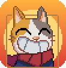
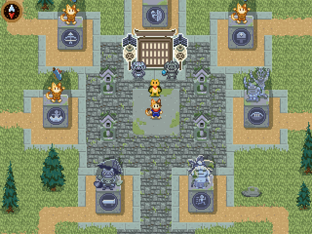
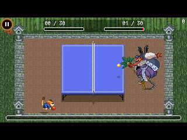
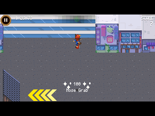
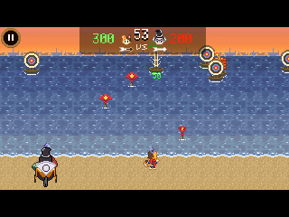
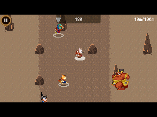
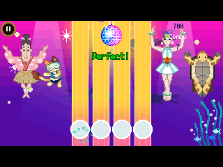
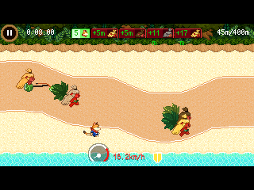
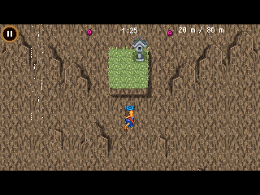
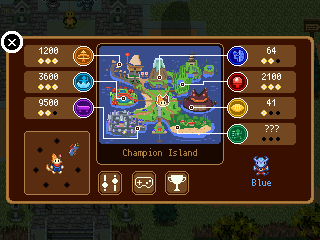

> **Champion Island is a [NumPlay](https://github.com/Mason363/NumPlay#readme) game that comes on its own.** It fills the calculator's whole app space, so it can't sit next to NumPlay. Get `ChampionIsland.nwa` from the [latest release](https://github.com/Mason363/NumPlay/releases/latest).
>
> This repository mirrors the `games/championisland` folder of NumPlay and is updated automatically: changes go to NumPlay, and edits made here are overwritten.

  

<h1 align="center">Champion Island</h1>

  <b>The Doodle Champion Island Games for the NumWorks calculator.</b> 
  Explore the island as Lucky the ninja cat, meet its people and beat all seven champions.

  <a href="https://github.com/Mason363/NumPlay/releases/latest/download/ChampionIsland.nwa"><b>Download ChampionIsland.nwa</b></a>
  &nbsp;·&nbsp; <a href="#controls">Controls</a>

  

## Highlights

* **The whole island:** every path, house and cave of the original, with its 57 rooms, its people, their stories and side quests, and the four teams.
* **All seven sports:** Table Tennis, Skateboarding, Archery, Rugby, Artistic Swimming, Marathon and Climbing, with the same rules, champions and harder versions as the original.
* **The original's look:** every picture and animation comes from the doodle itself, down to the rain over the Table Tennis village and the island's opening scene.
* **Full screen:** the island fills the calculator's whole screen, so you see more of it around Lucky than the original's wide frame shows. The sports and the insides of houses keep the original's frame.
* **Medals and the map:** Back opens the island map with your scores and stars, and your team.
* **Saved as you go:** quit at any time and you come back where you were. Your progress is also copied into `champion_saves.py`, so installing the app again doesn't erase it.

<table>
  <tr>
    <td align="center"> Table Tennis against the Tengu</td>
    <td align="center"> Skateboarding: grinds and tricks</td>
  </tr>
  <tr>
    <td align="center"> Archery against Yoichi</td>
    <td align="center"> Rugby: pass the ball past the oni</td>
  </tr>
  <tr>
    <td align="center"> Artistic Swimming, on the beat</td>
    <td align="center"> The Marathon, from 400 m to 5000 m</td>
  </tr>
  <tr>
    <td align="center"> Climbing the mountain</td>
    <td align="center"> The island map, with your medals</td>
  </tr>
</table>

## How to play

Walk around the island, talk to people with OK and step through doors and gates. Each champion waits somewhere on the island: go to them to play their sport. Win gold in all seven to see the end of the story.

Every sport shows its rules and keys before it starts. Back pauses it: from there you can restart, read the rules again or go back to the island.

## Controls

| Key | What it does |
|---|---|
| Arrows (or 4, 6, 8, 2) | Walk, and play |
| OK, EXE or 5 | Talk, go through doors, and each sport's action |
| Back | On the island: the map. In a sport: pause |
| Home | Save and quit |

| Sport | Arrows | OK |
|---|---|---|
| Table Tennis | Move to the ball | Power shot |
| Skateboarding | Move and do tricks | Jump and do tricks |
| Archery | Move | Shoot |
| Rugby | Move | Pass |
| Artistic Swimming | Hit the arrow beats | |
| Marathon | Move | Dodge |
| Climbing | Move | Jump |

## Good to know

* **One app at a time:** Champion Island takes all the room the calculator has for apps. Installing it from the NumWorks website swaps out NumPlay and the other apps, and installing NumPlay again swaps it back out. Your progress in each one is kept.
* **No films or music:** the original's animated films don't fit on the calculator, so the story goes on as it does after them. The calculator has no speaker.
* **Leaderboard:** the calculator is offline, so the leaderboard shows your own team's points.

## Credits

Inspired by the Doodle Champion Island Games (2021). Not affiliated with Google or STUDIO4°C.

* The pictures, animations, maps and texts come from the doodle's own files, as kept in the [Google-Doodle-Champion-Island](https://github.com/potherca-blog/Google-Doodle-Champion-Island) archive by potherca-blog.
* Font: [PixelMplus](https://itouhiro.github.io/PixelMplus/) by Itou Hiroki, based on the M+ fonts ([license](LICENSES/PixelMplus.txt)).

Made by Mason Chen as part of NumPlay.

## License

The game's code is licensed under the GNU General Public License v3.0: see the `LICENSE` file at the root of the repository. The doodle's pictures, animations, maps and texts, and the font, keep their own terms (see Credits).
